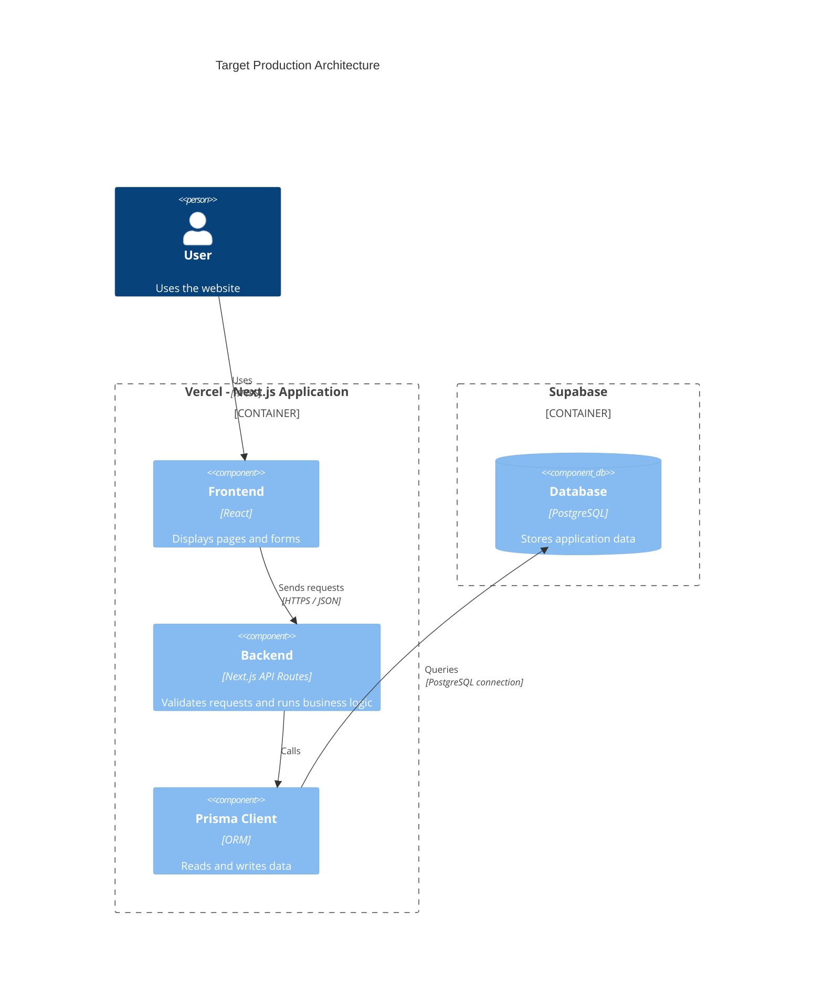

# Deployment

## 1. Hosting choices and justification

### Application: Vercel
The Next.js application, including the frontend and backend API
routes, will be hosted on Vercel to simplify deployment from GitHub.

Prisma Client runs inside the backend and connects to PostgreSQL.
It does not need separate hosting.

### Database: Supabase
PostgreSQL is hosted on Supabase, so I do not need to install
and maintain the database server myself.

I remain responsible for the tables, relationships, migrations,
and application access to the data.

### Docker
Docker will not be used for this production deployment.

Docker Compose provides an alternative local setup with:
- A PostgreSQL database.
- A service that applies database migrations.
- The built Next.js application.

For daily development, I use `npm run dev`.

## 2. Target architecture

The application will run on Vercel.
Prisma Client will connect the backend to PostgreSQL hosted on Supabase.



## 3. Prerequisites

### Project dependencies
Declared versions in `package.json`:
- Next.js: `^15.5.27`
- React and React DOM: `19.1.0`
- Prisma CLI and Prisma Client: `^6.19.3`
- TypeScript: `^5.9.3`

Use `npm ci` to install the versions recorded in `package-lock.json`.

### Runtime
- Vercel: Node.js `24.x`.
- Local Docker image: Node.js `20-alpine`.

### Required access
- GitHub repository access.
- Vercel project access for deployment.
- Supabase project access for database configuration and migrations.

### Production environment variables
The Prisma schema reads:
- `DATABASE_URL`: application connection to PostgreSQL.
- `DIRECT_URL`: connection used by Prisma migration tools.

Configure these names in Vercel with the production database
connection values. Never include secret values in this document.

`DATABASE_URL_PROD` and `DIRECT_URL_PROD` are not referenced
by the current Prisma schema.

### Optional local Docker setup
Requires Docker Desktop and these environment variables:
- `POSTGRES_DB`
- `POSTGRES_USER`
- `POSTGRES_PASSWORD`

These variables configure the local database, not Supabase.
Docker Compose constructs the local `DATABASE_URL` and `DIRECT_URL`
from these values.

### Domain and backups
- Production URL: not yet documented.
- Custom domain: not yet confirmed.
- Database backup and restoration procedure: not yet verified.

## 4. Deployment procedure


### Planned application deployment
1. Push the application code and `package-lock.json` to GitHub.
2. Import `RehabAlzarqa/Skillspoints2026` into Vercel.
3. Select Next.js as the framework and `main` as the production branch.
4. Use Node.js `24.x`.
5. Configure `DATABASE_URL` and `DIRECT_URL` with the Supabase
   production connection values.
6. Set the Build Command to:

   ```bash
   npx prisma generate && npm run build
   ```

7. Deploy the application.
8. Review the build logs and open the deployment URL.

Docker Compose is not used for this Vercel deployment.
The Build Command generates Prisma Client and builds Next.js;
it does not apply database migrations.

## 5. Verification

- Pending: confirm that GitHub Actions checks pass for the deployed commit.
- Pending: confirm that the Vercel deployment status is Ready.
- Pending: open the deployment URL and verify that `/` and `/signup` load.
- Pending: request `/api/courses` and verify the expected JSON response.
- Pending: check Vercel runtime logs for database connection errors.

## 6. Rollback — Bonus

If a new deployment causes a critical error, restore a previous
working deployment on Vercel after checking its compatibility
with the current database.

Rolling back the application does not undo database migrations.
Database changes require a separate recovery plan and, if needed,
a verified backup.

- Pending: identify a previous working deployment.
- Pending: document and test the Vercel rollback steps.
- Pending: document and test database recovery.